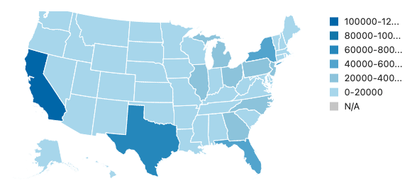
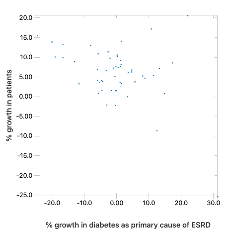
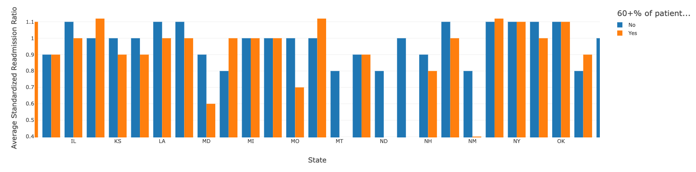

# Analysis of Medicare Dialysis Facilities

The purpose of this notebook is to ingest data from the Center for Medicare and Medicaid Services about [dialysis facilities](https://data.cms.gov/quality-of-care/medicare-dialysis-facilities) from 2017 and 2020 and understand more about the characteristics of dialysis patients from these facilities and their health outcomes. The data used in this analysis is stored in a Simple Storage Service (`S3`) AWS bucket and analyzed using `SQL` and `PySpark` in the Databricks platform.

Details about the data include:

* The raw data set contains over 10,000,000 rows and 14 columns including state, dialysis provider name, attribute or Measure ID, and values for those measures
* The following features are of particular interest in this analysis:
  * Number of dialysis patients seen at the facility
  * Percentage of incident dialysis patients who reported diabetes as a primary cause of End-Stage Renal Disease (ESRD)
  * Standardized Readmission Ratio (`SRR`), expressed as the ratio between total observed to total expected readmissions associated with a facility. The higher this ratio is, the more readmissions are associated with a facility, and the lower the quality of life for dialysis patients.

The following research questions were examined using the data:
* Is there growth in the number of dialysis patients between 2017 and 2020?
* Is there an association between growth rates in the average share of patients who reported diabetes as the primary cause of ESRD and the growth in the number of patients?
* Is there a significant difference in the average SRR for facilities for whom 60% or more of patients received pre-ESRD nephrologist care for 12 months or more?

The first two research questions are designed to better understand the prevalence and causes of the prevalence of ESRD. The third question is designed to understand whether initiatives aimed at increasing access to nephrologist care can improve readmission outcomes for beneficiaries. Overall, this analysis is intended to serve as background information to explore determinants of high readmission rates from dialysis facilities. This information can aid health care policy makers in identifying patient and facility characteristics and practices associated with positive and negative health care outcomes such as readmission rates to identify opportunities to correct health habits and other risk factors associated with readmissions before they occur.

### Growth in the number of dialysis Facilities

On average, per facility, the number of patients is around 100, between 2017 and 2020. Some of the largest states, as expected, are home to largest number of dialysis patients such as California, Florida, Texas, and New York. In a future analysis, the number of dialysis patients per capita will be examined. The map below categories states by the number of dialysis patients, highlighting the states with the most dialysis patients.

Some states have significantly higher growth rates in the number of dialysis patients compared to other states. States such as Utah, Maine, South Dakota, Arizona, and Alaska have growth rates in the number of patients at 14% or higher. It is imperative for state health agencies to understand the reasons behind the growth in the number of dialysis patients and implement preventative policies that will decrease the risk of ESRD for elderly patients.

### Relationship between the growth in the share of patients for whom diabetes is a primary cause of ESRD and the growth rate in the number of patients

Understanding comorbidities such as diabetes as a cause of ESRD is key to understanding health factors in need of correction or support to increase the likelihood of positive outcomes such as lower readmission rates. There is a moderately negative relationship between the share of patients whose primary cause of ESRD is diabetes and the growth rate in the number of dialysis patients. This result is counter intuitive and needs to be understood more because a growth in this comorbidity is expected to be associated with growth in the number of dialysis patients.

### Difference in the average SRR for facilities where most patients received pre-ESRD nephrologist care

For facilities for which 60% or more of patients received pre-ESRD nephrologist care, in some states including New Mexico and Maryland the average SRR was lower among facilities with 60% or more of patients who received pre-ESRD nephrologist care. In other states, such as Indiana, the average SRR was higher among patients who received this type of care. Further study is needed to understand the determinants of higher than expected SRR to implement public policies targeting the factors that increase the chances of higher readmissions.

